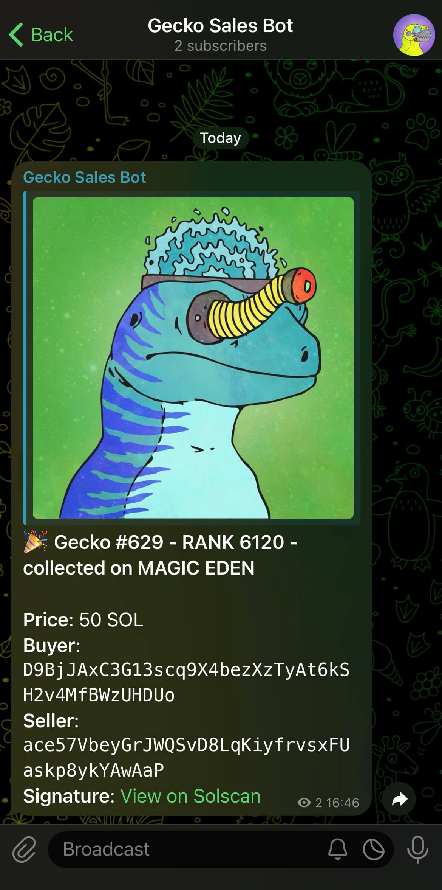

# Gecko Sales Bot

This project is a Cloudflare Worker that listens to Gecko NFT sales events via
Helius webhooks and sends notifications to a Telegram chat. It's based on the
[Helius Cloudflare Telegram template](https://github.com/helius-labs/cloudfare-telegram-template).

<p align="center">
  
</p>

## Setup Instructions

1. Clone this repository:

   ```
   git clone https://github.com/GalacticGeckoSpaceGarage/gecko-sales-bot.git
   cd gecko-sales-bot
   ```

2. Install project dependencies:

   ```
   bun install
   ```

3. Configure environment variables: Create a file named `.dev.vars` in the root
   directory and add the following variables:

   ```
   TELEGRAM_BOT_TOKEN=your_telegram_bot_token
   TELEGRAM_CHAT_ID=your_telegram_chat_id
   HELIUS_API_KEY=your_helius_api_key
   AUTH_TOKEN=your_auth_token
   ```

   Replace the values with your actual credentials:

   - `TELEGRAM_BOT_TOKEN`: Your Telegram bot token (get it from
     [@BotFather](https://t.me/botfather))
   - `TELEGRAM_CHAT_ID`: Your Telegram chat ID (see instructions below)
   - `HELIUS_API_KEY`: Your Helius API key (obtain from
     [Helius dashboard](https://dashboard.helius.dev/))
   - `AUTH_TOKEN`: A unique authentication token (generate as shown below)

   To get your `TELEGRAM_CHAT_ID`:

   1. Create a channel and add your bot as an administrator.
   2. Send a dummy message to the channel.
   3. Visit: `https://api.telegram.org/bot<YOUR_BOT_TOKEN>/getUpdates`
   4. Find the `"chat":{"id":` field in the response. This is your
      `TELEGRAM_CHAT_ID`.

   To generate your `AUTH_TOKEN`, run this command in your terminal:

   ```
   openssl rand -base64 32
   ```

4. Deploy to Cloudflare:

   ```
   bun run deploy
   ```

5. Create the webhook:
   ```
   curl --request POST \
   --url https://your-worker-url.workers.dev/create-webhook \
   --header "Authorization: AUTH_TOKEN" \
   --header "Content-Type: application/json" \
   --data "{}"
   ```
   Replace `your-worker-url` with your actual worker URL.

You can use this `/webhook` endpoint for other Helius services that require a
webhook URL.

That's it! Your Gecko Sales Bot should now be operational and will send messages
to your Telegram channel when Gecko NFT sales occur.

## Customization

Modify `src/index.ts` to change webhook creation or message formatting specific
to Gecko NFT sales.

## Troubleshooting

- Ensure all environment variables in `.dev.vars` are correctly set for
  development environment.
- Ensure all environment variables are manually added on the Cloudflare worker
  dashboard for production.
- Verify that the bot has permission to send messages to the Telegram channel.
- Review Cloudflare Worker logs for any errors.

For more assistance, refer to the
[Cloudflare Workers documentation](https://developers.cloudflare.com/workers/)
or [Helius documentation](https://docs.helius.dev/).
